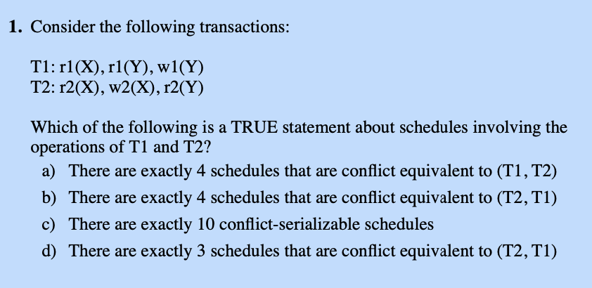

# Conflict Serializability Algorithm
 
## Helps to Solve Questions like: 

  
## How to Use:

- Start by writing your transactions in conflictEquivalnce.py. I have used two transactions t1 and t2. 

- Now two text files are created once you run the python file - t1t2.txt and t2t1.txt. These are transactions for T1-T2 and T2-T1 respectively. 

- Change the variable fileName to "t1t2.txt" or "t2t1.txt" as per need. 

- Run App.java and you will see the schedules that are conflict equivalent to Tx-Ty where x and y are of your choosing. 
